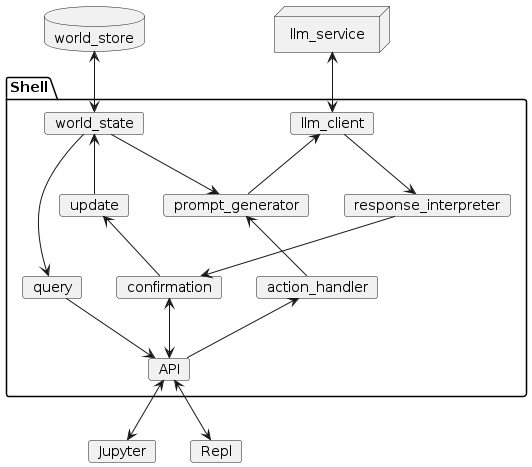

# LLM DM

Connect and start a game where all of the creative effort
of running a TTRPG is done by an LLM.

## Concepts

Shell that manages some loosely-structured state and does
some automated prompt engineering.



## Setup

``` shell
conda create -n llm-gm
conda activate llm-gm
conda install ipykernel # I use Jupyter extension in VS Code
pip install openai
```

And now, select the `llm-gm` conda environment in VS Code